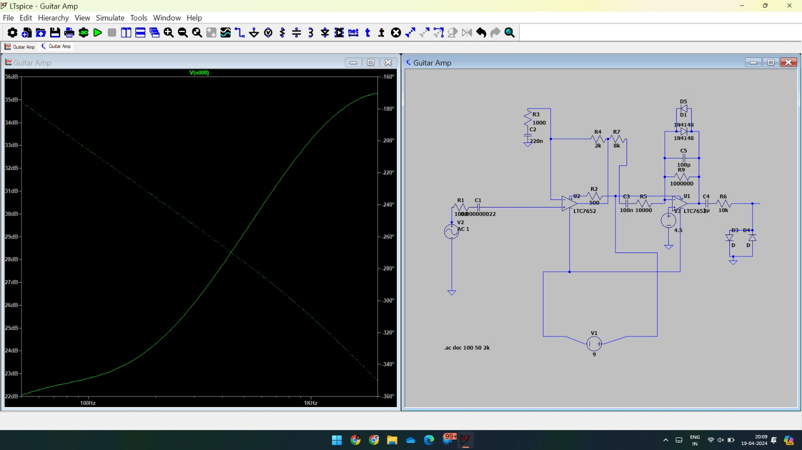
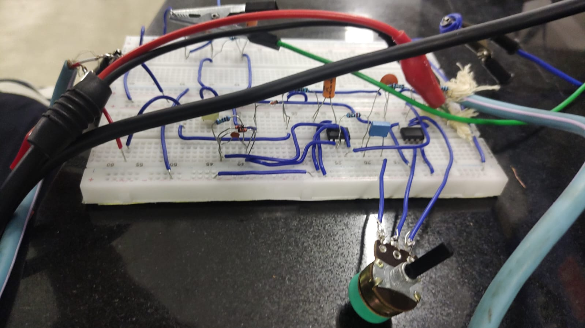
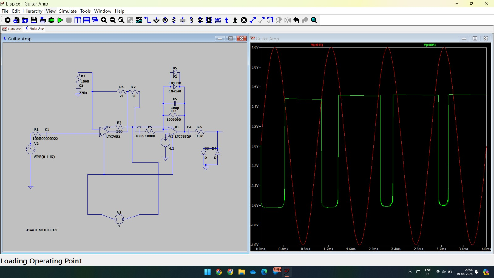
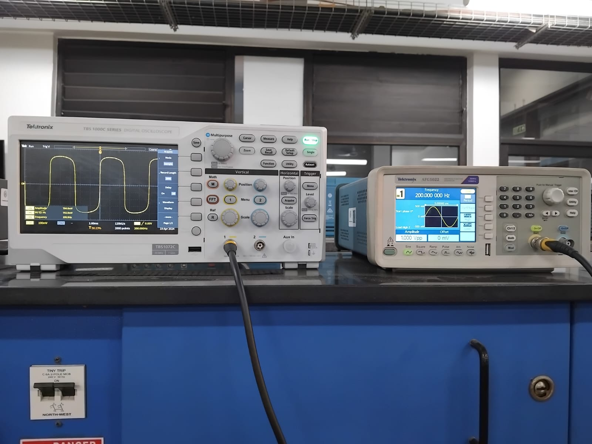

# 🎸 Analog Guitar Distortion Pedal

### ES116: Principles and Applications of Electrical Engineering – Final Project

A project by:
- Goraksh Bendale (23110118)
- Goral Mashru (23110119)
- Gosike Raviteja (23110120)

---

## 📄 Abstract

This project details the design and study of an analog circuit that produces a signal distortion effect from scratch. Such effects are widely used in the music industry with electric guitars. The design utilizes diode clipper circuits along with high-pass and low-pass filters to clip the signal and filter out unwanted noise. The circuit achieves both soft and hard distortion using common components like diodes, op-amps, resistors, and capacitors, without any microcontrollers. The output waveforms were observed through both LTspice simulations and a physical hardware prototype.

---

## ⚙️ Theory of Operation

The core of this distortion pedal lies in **diode clipping circuits**. Diodes allow current to flow in one direction and have a forward voltage drop (e.g., 0.7 V for silicon diodes). This property is exploited to "clip" the peaks of an audio signal, creating the distorted sound.

- **Soft Clipping**: Achieved by placing two diodes in parallel in the op-amp's feedback loop. This gently rounds the edges of the clipped waveform, producing a smoother, warmer, "tube-like" tone.
- **Hard Clipping**: Achieved by connecting two parallel diodes from the signal path to the ground. This aggressively chops off the signal peaks, resulting in a flat, square-wave-like signal with a harsher tone.

This circuit incorporates both soft and hard clipping stages to create a versatile distortion effect.

---

## 🛠️ Hardware

### 📐 Circuit Schematic

The circuit was designed and simulated using LTspice. The schematic below shows the complete circuit with two op-amp stages for gain and clipping.

  
*Figure 1: LTspice circuit schematic showing component values and connections.*

---

### 🧾 Bill of Materials

The following components are required to build the circuit:

| Component     | Description                      | Purpose                                             |
|--------------|----------------------------------|-----------------------------------------------------|
| **Op-Amp**   | UA741 or similar                 | Signal amplification and buffering                  |
| **Diodes**   | 1N4148, LEDs                     | Clipping the audio signal                           |
| **Resistors**| Fixed & variable (pots)          | Gain, tone, volume control                          |
| **Capacitors**| pF, nF, µF range                | Filtering and op-amp stability                      |
| **Breadboard**| Standard prototyping board      | To assemble the physical circuit                    |
| **Switch**   | SPDT or DPDT                     | For bypassing or mode switching                     |
| **Wires**    | Jumper/Connecting wires          | Connecting all circuit elements                     |

---

### 🔧 Physical Prototype

The circuit was assembled on a breadboard for testing.

  
*Figure 2: The assembled circuit on a breadboard.*

---

## 🔬 Simulation & Results

### 📉 Waveform Analysis

The simulation shows how a sine wave input is clipped by the circuit. The green waveform is the clipped output (distorted), and the red is the clean input.

  
*Figure 3: LTspice simulation showing input (red) and hard-clipped output (green).*

---

### 📈 Frequency & Gain Analysis (Bode Plot)

A Bode plot was used to analyze frequency response and gain variation with resistance in the op-amp feedback loop.

  
*Figure 4: Bode plot showing gain vs. frequency.*

---

### 🧪 Hardware Test Results

The hardware was tested using a Tektronix DSO and AFG3022 Signal Generator.

  
*Figure 5: Test setup with oscilloscope and signal generator.*

Input: 200 Hz, 1 Vpp sinusoidal wave → Output: ~0.7 V clipped waveform (matches diode forward voltage). Higher input amplitudes produced sharper, more aggressive distortion.

---

## 🎥 Video Demonstration

A video (`videoplayback.mp4`) documents:

- Circuit behavior with a guitar
- Simulation outputs
- Real-time distortion audio through a small amplifier

Gain control is shown adjusting distortion intensity in real time.

---

## 💬 Discussion & Future Scope

The project successfully demonstrated diode-based audio clipping as a method for guitar distortion. Both hardware and simulation results closely matched theoretical expectations.

**Improvements/Future Work**:
- **Tone and Volume Controls**: Require refinement for precise user control
- **Diode Experimentation**: Use LEDs, Schottky, or Ge diodes for tonal variation

---

*This project stands as a foundational analog circuit exercise with practical musical applications. A stepping stone toward more advanced analog audio systems.*
